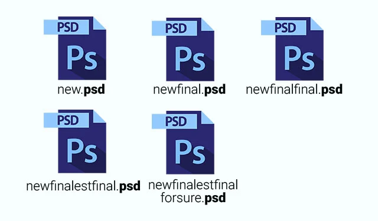

# Branches and Pull Requests

## No More of This!

## What are Branches?

Branches are copies of the code that exist in different states. For example, a repository might have:

- A `main` or `master` branch which contains the currently published version of the code.
- A `develop` branch to test changes before they go to `main`.
- Several `feature` branches where features in development are worked on.
- Several `bugfix` branches where bug fixes in development are worked on.

## Example Flow

1. Start a feature by creating a new branch called `feature-1` off of the `develop` branch.
2. Make your code changes inside this `feature-1` branch.
3. To prepare for your pull request by making sure the `feature-1` branch is up-to-date and resolving any merge conflicts.
4. Once ready, a pull request to merge `feature-1` to `develop`.
5. Once approved, the `develop` branch will be updated with the new code and the `feature-1` branch can be deleted.
6. The code owners will test the new code on the `develop` branch.
7. Once they're confident that the code is in good shape, they will merge the changes from `develop` to `main` by making another pull request.
