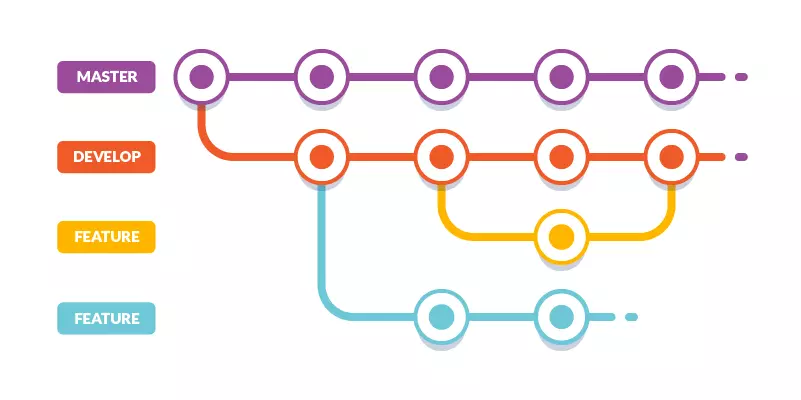

# Branches

## No More of This!

## What are Branches?

Branches are copies of the code that exist in different states. This allows you to make changes while keeping the codebase safe.

For example, a repository might have:

- A `main` or `master` branch which contains the currently published version of the code.
- A `develop` branch to test changes before they go to `main`.
- Several `feature` branches where features in development are worked on.
- Several `bugfix` branches where bug fixes in development are worked on.

However, this doesn't have to be the branch setup! You can create as many branches as you want and name them however you like.

## Example Repo

https://github.com/audacity/audacity/
