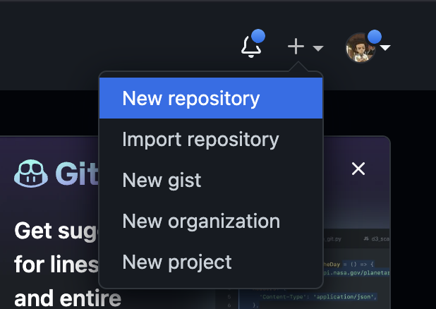

# How do I make a repository?

:::info

For developing serious projects, you'll want to use the `git` command-line tool or the [GitHub Desktop](https://desktop.github.com) application to sync projects between your computer and GitHub. For now, you can do everything within the GitHub site.

:::

1. [Create a GitHub account](https://github.com/signup).
2. Head to the GitHub homepage and click this button to create your first repository:

(Alternatively, you can just go to `github.com/new`)
