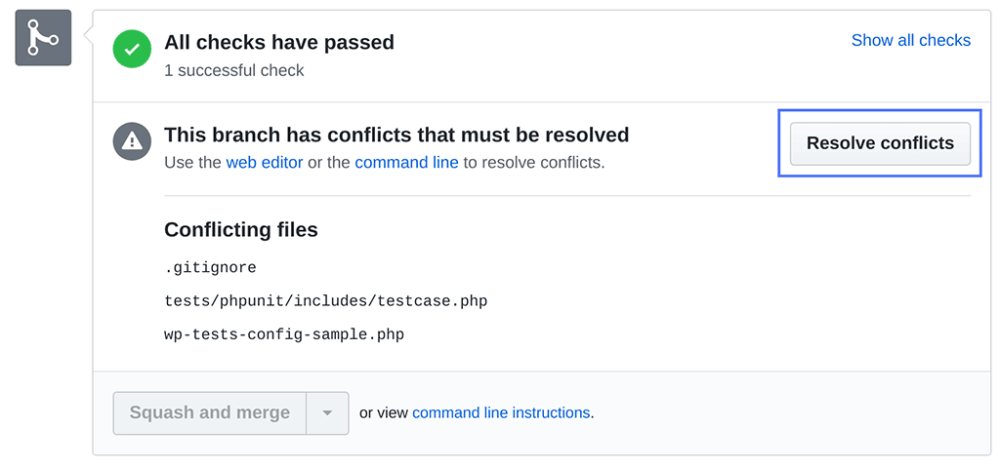

# Pull Requests

When you're ready to merge your changes into the project, you'll need to make a pull request. When you make a pull request, for example from the `feature-1` branch to the `develop` branch, you are **_requesting_** for the `develop` branch to **_pull_** in changes from `feature-1`.

To do so, the branches must be mergeable.

## Mergeability

### Ready to Merge

- If the base branch has had no changes, your pull request is mergeable.
- If the base branch has had changes, but they are on different lines or different files than your changes, you must pull the changes into your branch and then your pull request will be mergeable.

### Merge Conflicts

- If the base branch has had changes in the same places as your changes, you must resolve the [merge conflicts](https://docs.github.com/en/pull-requests/collaborating-with-pull-requests/addressing-merge-conflicts/about-merge-conflicts) and then your pull request will be mergeable.

## Example Flow

1. Start a feature by creating a new branch called `feature-1` off of the `develop` branch.
2. Make your code changes inside this `feature-2` branch.
3. To prepare for your pull request by making sure the `feature-1` branch is up-to-date and resolving any merge conflicts.
4. Once ready, a pull request to merge `feature-1` to `develop`.
5. Once approved, the code owners will merge `feature-1` into `develop`, and delete the `feature-1` branvh.
6. The code owners will test the new code on the `develop` branch.
7. Once they're confident that the code is in good shape, they will merge the changes from `develop` to `main` by making another pull request.
