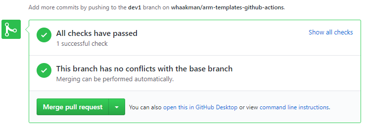

# Pull Requests

When you make a pull request, for example from `feature-1` to `develop`, you are **_requesting_** for the `develop` branch to **_pull_** in changes from `feature-1`.

## Mergability

### Ready to Merge

- If the base branch has had no changes, your pull request is mergeable.
- If the base branch has had changes, but they are on different lines or different files than your changes, you must pull the changes into your branch and then your pull request will be mergeable.

### Merge Conflicts

- If the base branch has had changes in the same places as your changes, you must resolve the [merge conflicts](https://docs.github.com/en/pull-requests/collaborating-with-pull-requests/addressing-merge-conflicts/about-merge-conflicts) and then your pull request will be mergeable.
