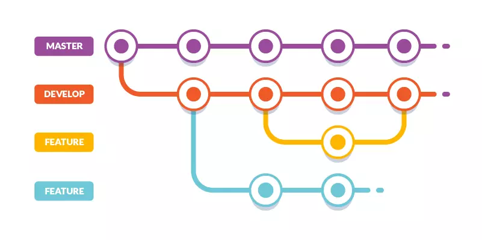

# Repositories

<!-- A repository is basically a folder on GitHub that contains your code (and/or other files). Repositories can be publicly accessible or private. -->

## Branches

A typical flow might look like this:

1. Start a feature by creating a new branch called `feature-1` off of the `develop` branch.
2. Make your code changes inside this `feature-1` branch.
3. To prepare for your pull request by making sure the `feature-1` branch is up-to-date and resolving any merge conflicts.
4. Once ready, a pull request to merge `feature-1` to `develop`.
5. Once approved, the `develop` branch will be updated with the new code and the `feature-1` branch can be deleted.
6. The code owners will test the new code on the `develop` branch.
7. Once they're confident that the code is in good shape, they will merge the changes from `develop` to `main` by making another pull request.
