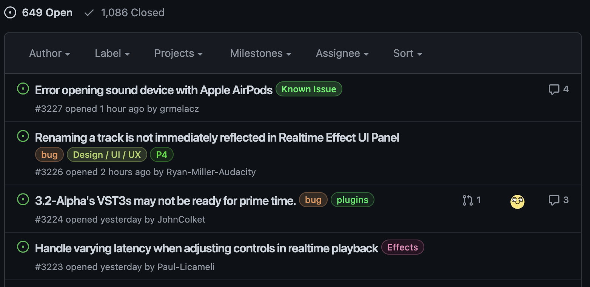

# Issues

Issues are:

- Feedback from contributors, users, and stakeholders
- Bug reports
- Feature requests
- Support questions
- A way for teams to keep track of what work needs to be done
- Similar to JIRA stories or Zendesk tickets

